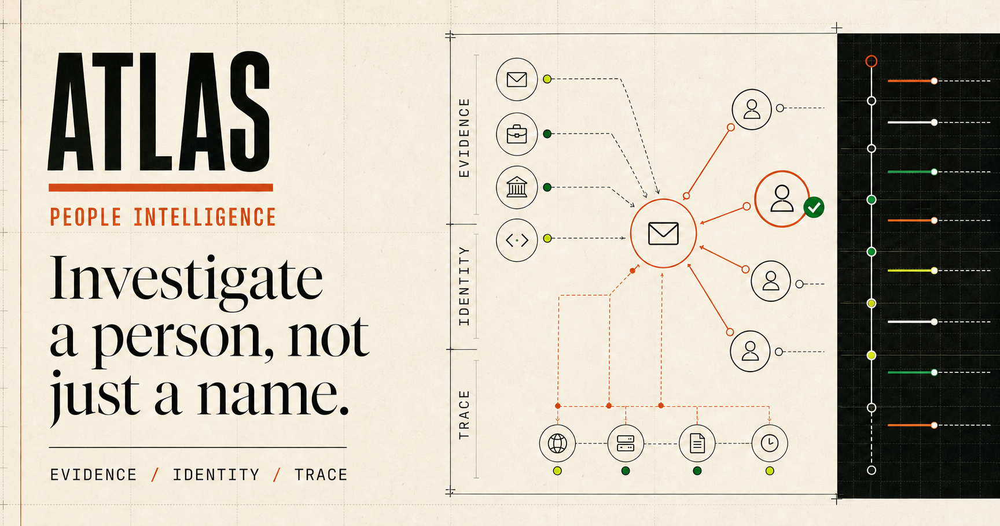

# Atlas

Hi Henry and Saarth! This is the takehome for Sixtyfour's internship where I (along with Codex and Claude) tried to replicate Atlas and make it have temporal presence (more about that later). 

My version of Atlas is an auditable public-source research agent for finding more about people. Its live scheduler performs a visible best-first search over an execution graph: it expands the lowest-cost legal source frontier first, keeps rejected and ambiguous branches, and reserves a small deterministic Metropolis-Hastings mutation lane for useful adjacent exploration (following the basic principles of Djikstra's algorithm). It separates same-name candidates, attaches every finding to direct evidence, exposes the full execution map, and stops when identity or coverage is insufficient.



## Run locally

Requires Node.js `>=22.13.0`.

```bash
npm ci --ignore-scripts
cp .dev.vars.example .dev.vars
npm run dev
```
You also need an API key to run this. Atlas supports the use of OpenAI, Gemini, and OpenRouter. 

Configure one server-side provider:

```dotenv
ATLAS_LIVE_ENABLED=true
OPENROUTER_API_KEY=your_key
OPENROUTER_MODEL=openai/gpt-5.4
OPENROUTER_SITE_URL=http://localhost:3000
OPENROUTER_APP_NAME=Atlas People Intelligence
```

Open `http://localhost:3000` and enter a target such as:

* `Henry Wang, Sixtyfour AI`
* `the CTO of Ariglad`
* `andrew.goering@ramp.com`
* `Sarah Chen, product designer, ex-Figma`

The interface streams the live search graph, source frontier, tool activity, evidence decisions, candidate resolution, and final report. Reports can be downloaded as JSON, Markdown, PDF, or trace NDJSON.

Never expose provider keys through `NEXT_PUBLIC_*` variables.

## CLI and API

```bash
npm run atlas -- research "Grace Hopper public professional background"
```

```bash
curl --fail \
  -H 'content-type: application/json' \
  -d '{"query":"Chris Anderson, TED"}' \
  http://localhost:3000/api/research
```

`POST /api/research` returns an `application/x-ndjson` stream ending in exactly one terminal event. This will result in runs that may complete, abstain, remain ambiguous, return partial results, or fail explicitly.

## How it works

Atlas uses LangGraph for agent control and a deterministic TypeScript kernel for safety, evidence admission, identity separation, confidence, budgets, retries, and stopping.

```text
START → classify → seed frontier → select action → plan
      → execute → admit evidence → assess
      ↘ synthesize ↔ continue search → END
```

The model chooses among bounded actions exposed by the kernel. It cannot invent tools, change candidate scope, bypass source ordering, or assign confidence directly.

Atlas searches the strongest available sources first:

1. Exact user-supplied URLs, handles, identifiers, or email
2. Official organization pages and personal websites
3. Professional profiles, code platforms, publications, patents, and public proofs
4. Universities, conferences, and primary publishers
5. Reputable reporting and interviews
6. Historical versions of already-verified pages
7. General web discovery

Up to four approved actions execute concurrently. Results are admitted in stable order so network timing cannot alter the report.

## OSINT capabilities

### Auditable search program

Atlas compiles bounded searches using exact phrases, organization and role anchors, `site:`, `filetype:pdf`, and `intitle:` operators across sources such as GitHub, LinkedIn, ORCID, Google Scholar, OpenReview, Semantic Scholar, and OpenAlex.

### Public GitHub codegraph

When the user explicitly supplies an email address, Atlas can search public GitHub commit metadata for exact author-email matches. It records immutable commits, repositories, linked accounts, dates, and signature status. It also takes advantage of phonebooks and public tax records (like usphonebook.com) to find the person easily and build a profile from there. 

### Historical profile analysis

For an already-verified public URL, Atlas can inspect Wayback Machine captures and report when professional information appeared, disappeared, or changed.
This is the most novel OSINT method that I created and it provides the search query with past historical data about any webpage, adding on to the metadata from the past. This is especially important for things like personal websites which change often and are kept in the Wayback Machine's digital archive. Referencing the past data about a person can lead us to create a full map of their digital history which is one of the biggest things when creating a profile report.  

### Public page footprint

Atlas extracts bounded page-declared metadata such as canonical URLs, Open Graph fields, JSON-LD types, application names, and referenced infrastructure providers. These observations remain clearly separated from verified identity claims.

## Identity and evidence

Same-name candidates remain isolated throughout the investigation. Evidence from one candidate can never support another.

Every finding contains:

* Candidate ID
* Claim and category
* Confidence and limitations
* Supporting and contradictory evidence IDs
* Direct source URLs
* Exact excerpts or labeled structured API claims
* Discovery method and timestamps

The final JSON includes the query, run status, candidates, selected identity, runner-up margin, findings, evidence, sources, coverage, limitations, usage, search graph, and stop reason.

## Traceability

Atlas records an append-only trace containing:

* Agent and graph transitions
* Tool names and sanitized arguments
* Source-frontier decisions
* Candidate scoring and rejection
* Evidence admission
* Retries and failures
* End-to-end and per-action latency
* Token usage and provider-reported reasoning-token counts
* Budget and stopping decisions

## Examples

The `examples/` directory contains three live investigation records covering:

| Input type            | Demonstration                                   |
| --------------------- | ----------------------------------------------- |
| Exact public email    | GitHub codegraph and evidence-confidence limits |
| Name and organization | Same-name candidate separation                  |
| Role description      | Identity resolution from indirect input         |

Each example includes:

```text
examples/<run>/
├── input.json
├── output.json
└── trace.json
```

## Verification

```bash
npm run verify
npm run security:audit
npm run test:browser
npm run test:browser:live
```

## Limitations

Public sources may be incomplete, outdated, spoofed, or contradictory. Atlas therefore preserves uncertainty and can terminate as `ambiguous`, `partial`, `rate_limited`, `budget_exhausted`, or `cancelled` instead of forcing a conclusion.
